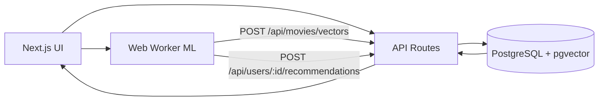

# Movies Recommend

Sistema de recomendação de filmes com arquitetura híbrida:
- **treino e score no Web Worker** (TensorFlow.js),
- **persistência vetorial no PostgreSQL + pgvector**,
- **reranqueamento vetorial no backend** para consolidar o top 3 final.

Este README está estruturado para uso técnico e apresentação em palestra.

## 1) Problema e proposta

O projeto resolve um cenário clássico de recomendação personalizada:
- o usuário seleciona um perfil,
- curte filmes,
- recebe sugestões de novos títulos alinhadas ao padrão de preferência aprendido.

A solução combina:
- **modelo supervisionado** (probabilidade de like),
- **busca vetorial** (proximidade entre embeddings),
- **filtros de catálogo** para exploração de conteúdo.

## 2) Stack e decisões técnicas

| Camada | Tecnologia | Papel |
|---|---|---|
| Frontend | Next.js 16, React 19, Tailwind | UI, estado de sessão, interação |
| Treino/Inferência | TensorFlow.js no Web Worker | Treino assíncrono e score de candidatos |
| Backend | Next.js API Routes | Contratos HTTP, persistência e ranking vetorial |
| Banco | PostgreSQL + pgvector | Dados relacionais + embeddings e distância vetorial |
| Linguagem | TypeScript | Contratos tipados entre camadas |

## 3) Arquitetura de alto nível



## 4) Como o modelo funciona

### Encoding de features

Cada filme é codificado no worker com pesos:
- `genre`: **0.4**
- `age_rating`: **0.3**
- `director`: **0.2**
- `idade média de quem curtiu`: **0.1**

### Treino

1. Worker carrega usuários (`/api/users`).
2. Constrói contexto (`makeContext`) com índices e normalizações.
3. Vetoriza filmes curtidos (deduplicados por `movie.id`).
4. Gera dataset supervisionado:
   - entrada: `userVector + movieVector`
   - label: `1` se usuário curtiu, `0` caso contrário
5. Treina rede neural (camadas densas com `relu` e saída `sigmoid`).
6. Persiste embeddings em `movie_vectors`.

### Inferência/recomendação

1. Worker calcula score dos candidatos de catálogo.
2. Seleciona candidatos mais fortes (threshold + fallback).
3. Envia candidatos para backend.
4. Backend faz reranqueamento vetorial no DB e retorna top 3.

## 5) Papel do banco vetorial

O `movie_vectors` é usado para:
- armazenar embeddings gerados (ingest + worker),
- calcular distâncias vetoriais (`<=>`) no `pgvector`,
- suportar reranqueamento no endpoint de recomendação.

Tabela de apoio:
- `user_movie_scores`: guarda score do modelo por usuário/filme e distância associada.

## 6) Fluxo funcional E2E

### A) Boot da aplicação
- carrega usuários,
- dispara treino inicial,
- habilita recomendações quando o treino termina.

### B) Like/Unlike
- `POST /api/users/[id]/like`,
- atualiza estado da UI,
- retrigger de treino/recomendação.

### C) Recomendação
- worker gera candidatos com score,
- backend reranqueia vetorialmente,
- UI exibe top 3 em `RecommendationPanel`.

### D) Retrain manual
- botão **Treinar modelo** na tela principal,
- evita dependência de refresh de página.

## 7) Estrutura de código (resumo)

```text
app/
  api/
    movies/
      route.ts
      vectors/route.ts
    users/
      route.ts
      [id]/like/route.ts
      [id]/recommendations/route.ts
  page.tsx
components/
  MovieGrid.tsx
  RecommendationPanel.tsx
  MovieCard.tsx
  UserSelector.tsx
controller/
  WorkerController.ts
hooks/
  useRecommendationsWorker.ts
worker/
  modelTrainingWorker.ts
lib/
  db.ts
  helpers.ts
  repositories/
    movieVectorsRepo.ts
    recommendationRepo.ts
  services/
    recommendationService.ts
  validators/
    requestValidators.ts
db/migrations/
scripts/
```

## 8) Execução local (sem Docker)

### Pré-requisitos
- Node.js 18+
- PostgreSQL com extensão `vector`

### Passos

```bash
cp .env.example .env
npm install
npm run db:create
npm run db:migrate
npm run ingest
npm run dev
```

Abra: [http://localhost:3000](http://localhost:3000)

## 9) Execução com Docker

```bash
docker compose up --build
```

O compose sobe:
- `db` (Postgres + pgvector)
- `app` (Next.js)

No startup da app:
1. `db:create`
2. `db:migrate`
3. `ingest`
4. `dev`

Parar:
```bash
docker compose down
```

Apagar dados:
```bash
docker compose down -v
```

## 10) API contracts (principais)

### `GET /api/users`
Lista usuários com `liked_movies`.

### `POST /api/users`
Cria usuário.
Payload:
```json
{ "name": "Novo Usuario", "age": 29 }
```

### `POST /api/users/[id]/like`
Alterna like de filme para usuário.
Payload:
```json
{ "movieId": 49026 }
```

### `POST /api/users/[id]/recommendations`
Recebe candidatos (`movie_id`, `score`), persiste score e reranqueia vetorialmente.

### `GET /api/users/[id]/recommendations`
Lê recomendações persistidas em cache para o usuário.

### `GET /api/movies`
Catálogo paginado com filtros:
- `search`
- `genre`
- `director`
- `cast` (nomes separados por vírgula)
- `minAgeRating`
- `maxAgeRating`

### `POST /api/movies/vectors`
Upsert de embeddings.

### `GET /api/movies/vectors?ids=1,2,3`
Busca embeddings por `movie_id`.

## 11) Observabilidade para demo

Durante a apresentação, vale mostrar:
- progresso de treino no header,
- logs do worker (epochs/loss/accuracy),
- payload de candidatos e top 3 final,
- `model_score` + `distance` no resultado.

## 12) Limitações atuais

- Dataset de exemplo reduzido para simulação.
- Feature engineering ainda simples (não usa sinopse, keywords, embeddings semânticos externos).
- Treino e inferência focados em execução local/browser.

## 13) Próximos passos recomendados

- Avaliação offline formal (Precision@K / Recall@K / NDCG).
- Versionamento de encoder vetorial.
- Batching de upsert vetorial para grande escala.
- Testes automatizados para fluxos worker + API.
- Camada de experiment tracking de hiperparâmetros e métricas.

## 14) Roteiro de palestra (5-8 min)

1. Problema e arquitetura híbrida (worker + pgvector).  
2. Demonstração de treino e recomendação ao vivo.  
3. Explicação do pipeline de score + reranqueamento vetorial.  
4. Filtros de catálogo e comportamento da UI.  
5. Lições de engenharia (tipagem, separação de camadas, responsabilidades).  
6. Roadmap de evolução.  
